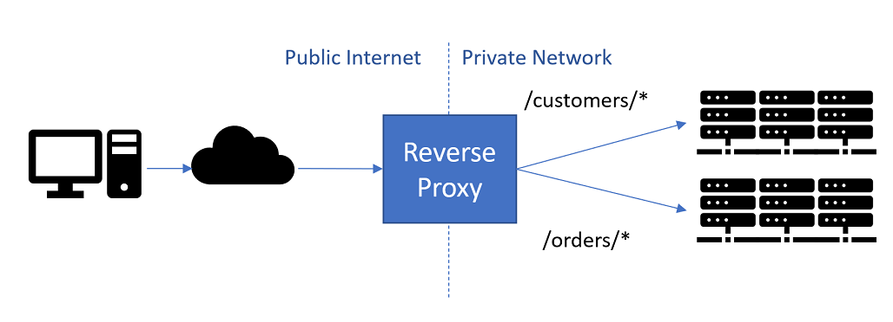

# FeedR
**Sample** .NET6 **microservices** solution which acts as the data aggregator for the different feeds.
The **purpose** of this solution is to **explore** the latest framework and **play** with different patterns, tools & libraries that can be useful when building **distributed applications** (but not only).
The overall repository structure consists of the following projects located under `src` directory:

- Gateway - API gateway providing a public facade for the underlying, internal services
- Aggregator - core service responsible for aggregating the data from different feeds
- Notifier - supporting service responsible for sending the notifications
- Feeds
  - News - sample feed providing the worldwide news
  - Quotes - sample feed providing the quotes

 

  
TOOLS

  <li><a href="#Tye">Tye</a></li>
  <li><a href="#Docker">Docker</a></li>
  <li><a href="#YARP">YARP</a></li>

 

## Tye

Tye is a tool that makes developing, testing, and deploying microservices and distributed applications easier. 
Project Tye includes a local orchestrator to make developing microservices easier and the ability to deploy microservices to Kubernetes with minimal configuration.

Documentation and installation: [Project Tye](<https://github.com/dotnet/tye>), [devblogs.microsoft.com](<https://devblogs.microsoft.com/dotnet/introducing-project-tye/>).
 

## Docker

### Overview
Docker is an open platform for developing, shipping, and running applications. Docker enables you to separate your applications from your infrastructure so you can deliver software quickly. With Docker, you can manage your infrastructure in the same ways you manage your applications. By taking advantage of Docker’s methodologies for shipping, testing, and deploying code quickly, you can significantly reduce the delay between writing code and running it in production.

### The Docker platform
Docker provides the ability to package and run an application in a loosely isolated environment called a container. The isolation and security allow you to run many containers simultaneously on a given host. Containers are lightweight and contain everything needed to run the application, so you do not need to rely on what is currently installed on the host. You can easily share containers while you work, and be sure that everyone you share with gets the same container that works in the same way.

Docker provides tooling and a platform to manage the lifecycle of your containers:

Develop your application and its supporting components using containers.
The container becomes the unit for distributing and testing your application.
When you’re ready, deploy your application into your production environment, as a container or an orchestrated service. This works the same whether your production environment is a local data center, a cloud provider, or a hybrid of the two.

More: [docker.com](<https://www.docker.com/>), [samples](<https://docs.docker.com/samples/dotnetcore/>)
 

## YARP

Yet Another Reverse Proxy!
Reverse proxies are used to listen to incoming HTTP requests and to forward the requests to appropriate servers based on the contents of the request. Unlike a typical firewall/router which acts at layer 4 (TCP/IP), reverse proxies typically work at layer 7 so they understand http and work based on http fields.

When YARP proxies a request, it handles the HTTP connection from the client, and then creates its own connections to the destination server, and both sides can benefit from connection pooling.

Using a reverse proxy has a number of advantages:

<li>It acts as the public endpoint for a site or set of services, enabling the url-space exposed to be independent from the actual implementation</li>
<li>Forwards calls to backend servers to perform real work, balancing load between them</li>
<li>Can offload work from backend servers such as TLS Encryption, Auth2, Compression, Caching</li>
 

More: [YARP](<https://microsoft.github.io/reverse-proxy/>), [YARP: The .NET Reverse proxy](<https://docs.microsoft.com/en-us/shows/on-net/yarp-the-net-reverse-proxy>)

